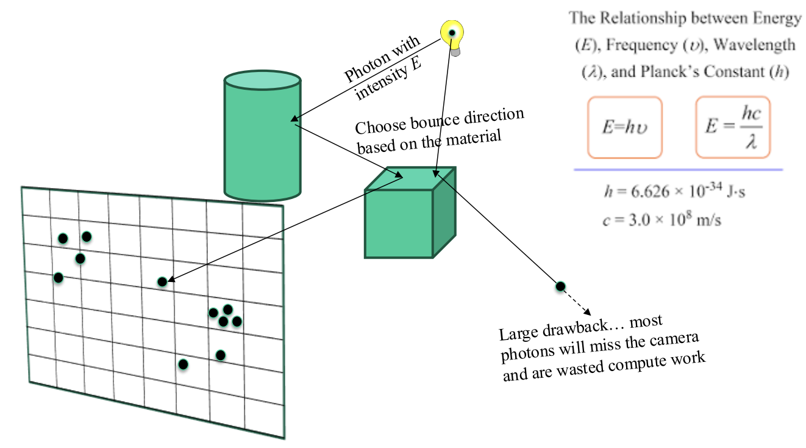
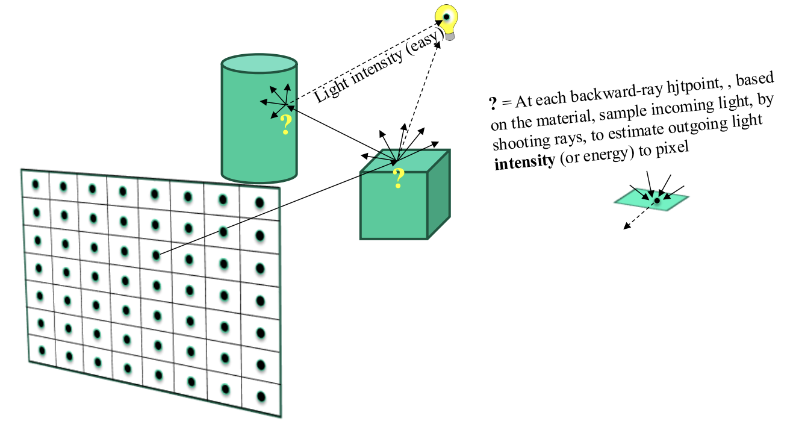
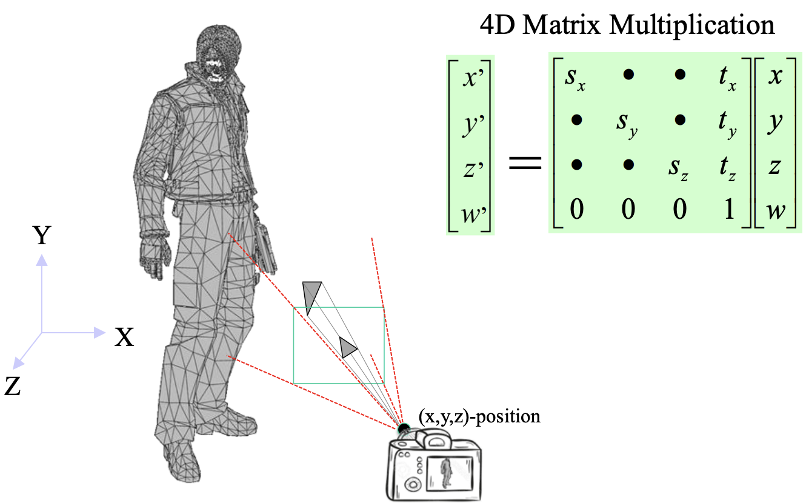
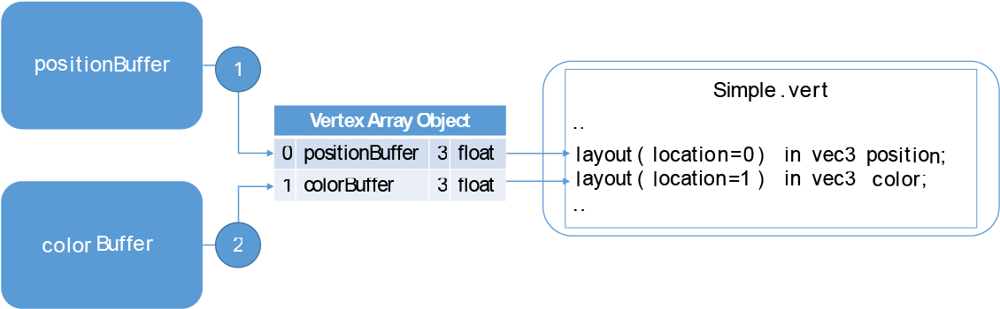

arrays, linked lists, trees and graphs
dot product, cross product, matrix multiplications (4D)

## Basics

vector: velocities, forces, acceleration, etc

- usually shown as an arrow (direction) e,g vector of ball = velocity (orientation + speed)
- completely defined by: direction and length
- vector length: || v ||
- vector sum: the sum of 2 vectors (u + v), forms in the tail point u to the tip tip of v
- formula for normalising a vector, a vector is normal if it's length is 1.

scalar vector multiplication:

## LEC1: Main principles

### Rasterization

- Draw the scene triangles one by one onto pixels of the screen, for each pixel, compute color based on light source and surrounding objects
-

### Ray Tracing

- **Forwards**: Tracing light beams from light sources and how they reach the virtual camera.

  - simple, automatically gives intensity (energy) distribution on screen
    
  - A way to form an image is to follow rays of light (photons) from a point source, finding which rays enter the lens of the camera
  - Each ray of light may have multiple interactions with objects before being absorbed or going to infinity
  - Algorithmically easy to generate, extremely slow approach
- **Backwards**: Tracing light beams backwards, i.e. from the camera and all the way back to the light sources

  - More efficient, but finding correct intensity and relevant incoming light directions is a sampling problem with more careful math correctness.
    
  - Follow rays of lights backwards, i.e. from the camera sensor (center of projection) into the scene until they either are absorbed by objects or go off to infinity
  - At each bounce position, estimate incoming light intensity and color by following possible bounce directions, given the material
  - Complicated but possible to get accurate convergence (Monte-Carlo sampling theory used for how to best sample an unknown signal), Faster approach but still slow compared to rasterization.

## Pipeline - Real-time rendering

- Based on rasterization
- 3D models: surfaces composed of triangles
  - Each triangle is projected into an image plane using virtual camera
    
  - GPU draws the triangles onto the screen

### Compute pixel color

- Use some shading model based on light source + triangle's material
- At rendering: GPU computer the reflected light towards the camera, per pixel
  - depends on light and material parameters
- Triangle colors: multiplied with lighting contribution, with an image (texture), the color is modulated with light intensity to get final pixel color

### What is a 3D scene

- Geometry (triangles, lines, points, and more)
- Light sources
- Material properties of geometry (colors, shader code, textures)
- A triangle has 3 vertices (vertex being its 3d position)

### 1. Application stage (runs on CPU)

### 2. Geometry stage (GPU)

### 3. Rasterizer stage (GPU)

# LEC2: Transforms, vector algebra for 3D graphics

- **cross product, vector product**: Binary operation on two 3D vectors, resulting in a vector perpendicular to both
- **triple scalar product:** scalar result of the dot product of a vector with the cross product of two other vectors.
  - The triple scalar product is given by $ \mathbf{a} \cdot (\mathbf{b} \times \mathbf{c}) = \det \begin{bmatrix} a_x & a_y & a_z \\ b_x & b_y & b_z \\ c_x & c_y & c_z \end{bmatrix} $.
- **model-to-world-transform**: Translates, rotates, and scales the object from its local model space into the global world-space.
- **world-space**: global coordinate system for an entire  3D scene. Represents the position/orientation for all objects relative in a scene relative to a common origin "world origin".
  - Used after objects have been transform from model-space (now placed in world-space). Allows multiple objects to exist within a unified scene.
- **model-space**: Local object space.
- **view-space (camera-space)**: Coordinate system relative to the camera's position and orientation. The camera is the origin, and everything else in the scene is position relative to it.
  - Camera position in view-space is always 0,0,0
- **world-to-view transform**: Moves and rotates the entire scene so the camera is at the origin, looking along its forward axis (typically the negative z-axis in most systems)

# Matrices

## Transforms

- we want to be able to animate objects and the camera (translatios, rotations, shears), use projection transforms
-

### Translation

### Rotation

#### Euler Angles

#### Rotation matrices

#### Quaternions

Use quaternions to define the rotation and calculate the new orientation of an object. Handle rotations in 3D space.

- best used in: animations, camera rotations, character movements.

### Scaling

### Shearing

### Reflection

## Matrix multiplication

## Transformation pipeline

# LEC3: Shading & aliasing

- "how to shade your fragments"
- ambient, diffuse, specular, emission
- formulas, phong's vsa blinn's specular highligt model
- flat, goraud, phong shading
- gamma correction
- fog
- transparency
- when does aliasing occur?
- sumersampling schemes
- jittered sampling "why is it good?"
- supersampling vs coverage sampling

# LEC4: Texturing

- filtering, magnification, minimification
- environment mapping
-

# LEC5: OpenGL

- how to achieve blending, transparency
- how to specify materials, textures per vertex attributes
- triangle - vertex order facing *(how to specify back face or front face)*

All geometric primitives are specified by vertices

## Vertex Order

## Specifying vertices and polygons

### Examples of using Vertex Arrays

## Texture mapping

### Other methods

### Reflections with environment mapping

## Shadow mapping

- shadow mapping is created per light source, shadow overlapping is handled naturally

### Depth comparison

### Bias

- z-fighting

### Blurring shadow edges - percentage closer filtering

## Blending

- can be used for transparency and also motion blur

### Temporal Anti-aliasing (TXAA)

# LEC6: Intersections

**geometrical primitives:**

- ray
- sphere
- box: axis-aligned (AABB), oriented (OBB)
- k-DOP (discrete oriented polytope)

## Techniques

### Rules - Intersection testing

- Acceptance/rejection tests (try them early on to make fast exist)
- postpone expensive calculations if possible
- Use dimension reduction
  - E.g. several one-dimensional tests instead of one complex 3d test, or 2d instead of 3d.
- Share computations between objects if possible

### Analytical - solving equation systems

- if both objects are described as functions, set them equal and solve
  - see ray/triangle test: tri(u,v)

#### Ray/sphere intersection test

- sphere center: **c**, radius: *r*
- ray function: **r**(*t*)=**o**+*t***d**
- sphere equation:||**p**-**c**||=*r*
- replace **p** by **r**(*t*), and square it:

#### Ray/plane intersection test

- Ray: r(t)=**o**+t**d**
- Plane: **n•x** + **d** = 0; (d=-**n•p**)
- Set **x**=r(t):
  - n•(o+td) + d = 0
  - n•o+t(n•d) + d = 0
  - t = (–d –n•o) / (**n•d**)

>>> todo add full equation here, slide 6
>>>
>>

#### Ray/triangle intersection test

Make 2 functions, for points along ray and inside triangle and set those 2 functions equal to each other.

- Ray:
- Triangle vertices:
- A point in the triangle:
  Set: ... and solve for t, u, v:

#### Ray/polygon: Crossing test

- Intersect ray with polygon plane
- project from 3D to 2D

1. Find max(|nx|,|ny|,|nz|)
2. Skip that coordinate
3. Count crossing n 2D

> The number of times this ray intersects the polygon edges is counted: If the number of crossings is odd, the point is inside the polygon. If even, the point is outside.

#### Point/plane

#### Separating Axis Theorem (SAT)

- SAT examples:
  - Triangle/box:
  -

### Geometrical - spatial reasoning

#### Ray/box intersection test

#### Sphere/plane - Box/plane

- AABB/plane:

#### View-Frustrum testing

- View frustrum is 6 planes: near, far, right, top, left, bottom
- Get their plane equations from projection matrix
- spere-frutstrum - common approach:

### Dynamic tests - finding time of collision

- Testing is often done in every rendered frame i.e, discrete times intervals

# LEC7: Spatial data structures & speedup techniques

### spatial data structures

data structures that organizes geometry in 2D or 3D or higher

### Bounding-volume hierarchy

Organizes geometry in some hierarchy (both in 2D and 3D)

- Includes a bottom-up and top-down construction

**Examples:**

In a Tree-structure

1. test the root first
2. descend recursively as needed
3. Terminate traversal when possible

get O(log N) instead of O(N)

**Common bounding volumes (BV):**

- Axis-Aligned Bounding Boxes (AABB)
- But can also use spheres and
  Oriented Bounding Boxes (OBBs)
- AABB hierarchies are used by the NVIDIA RTX chip

BV does not contribute to the rendered image (it encloses an object instead)

The data structure is a tree, leaves hold geometry, internal nodes hold BVs that enclose all geometry in its subtree

**Top-down construction:**

- Find minimal box, then split along longest axis

**Binary-partitioning trees**

- 2 different types:
- ddd

**Axis-aligned BSP tree**

- tree structure
- each internal node holds a divider plane
- leaves hold geometry
- differences compared to BVH:
  - BSP tree encloses entire space and provides sorting
  - The BV hierarchy can have spatially overlapping nodes(no sort)
  - BVHs can use any desirable type of BV

**Polygon aligned BSP tree**

* Allows exact sorting from camera
  * Since planes clip intersecting triangle
* Very similar to axis-aligned BSP tree
  * But the triangle planes are used as the splitting
    planes

### Octrees

- A bit similar to axis-aligned BSP trees
- Will explain the quadtree, which is the 2D
  variant of an octree
- In 3D, each square (or rectangle)
  becomes a box, and 8 children
- Expensive to rebuild
- Can be used for:
  - speedup raytracing
  - faster picking
  - culling techniques
  - Not used very often anymore. Mostly through Sparse Voxel Octrees (SVO:s)

**examples:**

- Recursively split space
  in eight parts – equaly
  along x,y,z dimension
  simultaneously for each
  20 level

**Sparse Voxel Octrees (SVO:s)**

### Scene graphs

A node hierarchy, often relfecting a logical hierarchical scene description

- often in combination with BVH such as that each node has a BV

Common hierarchical features include:

- lights
- materials
- transforms
- transparency
- selection

### Culling techniques

(red objects are skipped)

- view frustrum
- detail
- backface
- occlusion
- portal

**Backface culling**

- Can be used when back-faces are never seen (closed
  objects)
- OpenGL:
  - glCullFace(GL_BACK);
  - glEnable(GL_CULL_FACE);

1. define front/back-faces
   - Let counterclockwise vertex-winding order define front face
     (right-hand rule).

**View frustrum culling**

- Bound every “natural” group of primitives
  by a simple volume (e.g., sphere, box)
- If a bounding volume (BV) is outside the
  view frustum, then the entire contents of
  that BV is also outside (not visible)

**Portal culling**

Essentially a refined view frustrum culling

- frustrum gets smaller by each door

Only renders objects which are visible by the camera in the view frustrum

"Recursively do VFC through visible portals (i.e. doors & mirrors)"

**Occlusion culling**

Objects that lies completely “behind” another set of objects can be culled

the algorithm uses some kind of occlusion representation $O_{R}$

### Levels-of-Detail rendering (LODs)

- Use different levels of detail at different
  distances from the viewe. More triangles closer to the viewer

Far LOD rendering: when an object is far away. Replace it with a quad of some color

# LEC8 - Collision detection

https://www.realtimerendering.com/intersections.html

### Collision detection pipeline

- Broad-phase algorithms

  - sweep-and-prune, BVH
- Narrow-phase algorithms
- Continious collision detection
- Specialized techniques

**Bounding-volumes hierarchy**

If accurate result is needed, turn to BVHs:

- Use a separate BVH per object
- Test BVH against other BVH for overlap
  - For all intersecting BV leaves
  - Use triangle-triangle intersection test

**Sweep-and-prune (SAP) algorithm**

Assume high frame-to-frame coherency, meaans that object is close to where it was in the previous frame

- Collision overlap is done three times: One for the x,y-axes, and z-axes

1. Sort all $b_{i}$ and $e_{i}$ into a list
2. Traverse list from start to end
3. When $b$ is encounted, mark corresponding object interval as active in an `active_interval_list`
4. When an e is encountered, delete the interval in `active_interval_list`
5. All object intervals simultaneously in `active_interval_ list` are overlapping on this axis!

With this, sorting will be expensive: O(N*log N), frame-to-frame should therefore be exploited. In this case, resort with bubble-sort or insertion-sort, giving the expected complexity O(N).

**CD for many objects**


# Exam info

- z-buffer algorithm
- scaling matrix (transforms)
- vertex order facing (triangle front and back)
- real-time rendering principles in OpenGL (buffer types, shadow maps, how to do transparency)
- ray/sphere intersection tests
- ray/box intersection
- ray/triangle intersection
- Dynamic separating axis theorem
- Top-down BVH, AABSP-tree/bottom-up construction of BVH
- Axis-aligned BSP tree (where are the geometries stored: in the leaves)
- Scene graphs
- Octrees/quadtrees
- portal culling or culling techniques (occlusion is bonus material)
  - Backface culling – screenspace is robust, eyespace non-robust
- LODs (describe them)
- What is sweep-and-prune used for ? broad-phase collision detection
- 3 types of algorithms with rays (fast but not exact, why?)
- Collision detection with BVH (know the pseudocode BVH/BV test collision between 2 objects), examples of bounding volumes (spheres, AABBs, OBBs, k-DOPs)
- Pruning of non-colliding objects

# Tutorials

## Tutorial 1

#### debugging

- function call 'glClear' was the problem, since 'GL_BUFFER' isn't a valid argument, line 264

**Solution:**

```
glClear(GL_COLOR_BUFFER_BIT | GL_DEPTH_BUFFER_BIT);
```

We have to specify the buffers we want to clear, this is done using the bitwise OR operator. The GL_COLOR buffer clears the color buffer, where the color information is stored, while the GL_DEPTH clears the depth buffer, used for depth testing.

We need to clear the color and depth buffers at the start of each frame for consistent/correct rendering input. This is needed so that each frame starts as a "clean slate" so that each pixel only reflects the current frame's rendering, avoiding artefacts from previous frames. The use of buffers is part of the rasterizer stage in the rendering pipeline.

In the rasterizer stage we have the following **buffers**:

- z-buffer (depth buffer): stores for each pixel depth information (z-values) to resolve which objects are in front of others, "closest fragments z-value".
- stencil buffer (8-bits): for advanced rendering effects, masking or stencil operations.
- rgb buffer (color buffer): front and back, color values for each pixel in a frame.

#### Task 1: UI elements

We can render UI elements with the ImGUI library. In the code, the function gui() has the gui logic, which is then called inside the main function.

#### Task 2: Draw a triangle

The given code initializes vertex buffer objects in three steps, glGenBuffers(), glBindBuffers(), glBufferData(). These objects are initialized and handled in the initialize() function.

**Draw call functions:**

- glGenBuffers(): Generates buffer ID('name') and assigns it to a variable.
  - takes an integer count and a pointer to a variable, generating a unique buffer id and stores it in that variable.
- glBindBuffers(): Selects currently active buffer
  - binds a buffer object to the specified target 'GL_ARRAY_BUFFER', subsequent buffer operations apply to this bound buffer.
- glBufferData(): Copies data to currently active buffer
  - After binding the buffer, it specifies the buffer's data, copying data from system memory to GPU memory.

#### Task 3: Colors

- vertex color is declared as the attribute color in the simple.vert file inside shaders folder.
- We need to pass the vertex color value declared in simple.vert inside the fragment shader.

the vertex shader transforms color and position into attributes.

Each vertex of the shown triangle has a speciifc RGB value assigned.

**shader attribute layout**



*Buffer objects (BO):* positionBuffer and colorBuffer are BO. They hold the actual vertex data (positions, colors) and are linked to attributes in the shader.

*Vertex array objects (VAO):* vertexArrayObject is the VAO, it does not hold data, instead it references buffer objects and organizes how the data is interpreted and sent to the GPU.

Objects can be buffer objects (OB) or vertex array objects (VAO)

- link numbers: 2, 1 (in that order)
- Link number 1: typically for vertex positions glBindBuffer(GL_ARRAY_BUFFER, buffer).
- Link number 2: typically for color data, "vertex colors". glBindBuffer(GL_ARRAY_BUFFER, buffer);

`glBindBuffer(GL_ARRAY_BUFFER, buffer)` binds a buffer object (BO) to the current context. Which specifies that subsequent operations related to `GL_ARRAY_BUFFER` will affect this buffer.

`glVertexAttribPointer` defines how OpenGL should interpret this data for each attribute (like position or color), and `glEnableVertexAttribArray` enables that attribute.

The function `glVertexAttribPointer()` has the following signature:

```cpp
void glVertexAttribPointer(GLuint index,
       GLint size,
       GLenum type,
       GLboolean normalized,
       GLsizei stride,
       const GLvoid * offset_pointer);
```

- `normalized`, for integer inputs, it either normalizes them so they become values between -1 and 1, or transforms the actual value to float.
- `stride` is distance between the end of the attribute for one vertex and the start of the next one. 0 means they are tightly packed.
- `offset_pointer` indicates that the attribute for the first vertex begins N bytes from the beginning of the bound buffer. It's represented with a pointer due to backwards compatibility.

**Shader initialization**

- vertex and fragment shaders are linked together into one single program object, through the function glUsePogram() we can therefore draw a triangle.

*Process behind shader initialization:*


vertexShader (created with): `glCreateShader(GL_VERTEX_SHADER)`

fragmentShader (created with):`glCreateShader(GL_FRAGMENT_SHADER)`

shaderPorgram (created with): `glCreateProgram()`

*OpenGL call:*

- glLinkProgram(): C
- glCompileShader(): 1
- glCompileShader(): 2
- glShaderSource(): A
- glShaderSource(): B
- glAttachShader(): 3
- glAttachShader(): 4

Links A and B glShaderSource() is used to load the source code for the vertex and fragment shader (simple.vert, simple.frag).

Link 1 and 2 glCompileShader() compiles both shaders (vertex and fragment)

Link 3 and 4 glAttachShader() attaches the compiled shaders to the shaderProgram.

Link C glLinkProgram() links the compiled vertex and fragment shaders into the final shader program.

**Shader Linking**

the color output from vertex shader is linked to the color input of fragment shader by color (matching variable names and types between the two)

- vertex shader: has a declared variable `out vec3 color` (output variable)
- fragment shader: has a declared variable `in vec3 color` (input variable)

#### Task 4: More triangles

- step 1: create a new vertex array object in InitGL() function
- step 2: draw the object in the display() function
- avoid covering the existing triangle if possible.

**Shader execution:**

- during shader execution, the vertex shader will be executed once for each vertex in a single frame.
- the fragment shader will be executed once for each drawn pixel in the image in a single frame. (for each fragment)

#### Task 5: Uniforms to change color

We can change use information in many ways as input for shaders, the most straightforward is using vertex buffers. If we want all vertices to be in a rendered geometry so as to use the same value for some property, we can use *uniforms*.

*Uniforms*: constant value changed from the CPU code in a draw-call basis

- have the same value for all shaders executed using the `glDrawArrays` or similar
- can be changed from one draw-call to the next
- e.g. you can set a uniform to some color, call `glDrawArrays` for one triangle, set the uniform to a different color and call `glDrawArrays` for a second triangle, and each will receive the specified color in the shaders.
- with this approach, we need to set the fragment shader for uniform input and send the value of the CPU variable to uniform, including setting the GUI (to manually choose the color during runtime).

## Tutorial 2

**Initial code:**

The given code is drawn as an indexed mesh, meaning that instead of sending six vertices to the `glDrawArrays` function, a vertex buffer object (BO) containing the vertices of the quad is created, and second buffer object containing indices into this list is sent to the `glDrawElements` function.

answer: Likely to reduce redundancy and improve efficency in the data sent to the GPU. Here we define only four unique vertices (instead of 6 for 2 triangles) in a vertex buffer and then specify how to connect these vertices to form triangles using an index buffer.

**3D perspective camera:**

When setting a camera in a 3D space, we create a projection matrix as follows, defining four vertices in 3d space.

```cpp
mat4 projectionMatrix = perspective(fovy, aspectRatio, nearPlane, farPlane);
```

- field of view (fov): defines the vertical angle of the viewing cone in degrees, from the viewpoint.
- aspect ratio: ratio of the viewports width to its height (width/height)
- nearPlane: closest distance from the camera where objects start to be rendered.
- farPlane: farthest distance from the camera, where objects are still rendered. Anything beyonf this plane is clipped out and won't be visible.

The rendering area is between the nearPlane and farPlane, also called *view frustrum*.

#### Task 1: adding texture coordinates

- step 1: define texture coordinates textcoords[] array containing the (u, v) coordinates for each vertex
- step 2: generate a buffer object with the coordinate data
  - We first declare the textcoords buffer object together with the other BOs in the scene objects part.
  - Generate a buffer for `texcoordBuffer` with `glGenBuffers()`.
  - Bind `texcoordBuffer` with `glBindBuffer(GL_ARRAY_BUFFER, texcoordBuffer);`.
  - Send the texture coordinates data to the buffer using `glBufferData()`.
- Step 3: Set Up the Vertex Attribute Pointer for Texture Coordinates
  - Use glVertexAttribPointer() to set up a pointer for the texture coordinates.
    - Use index 2 (or the index you chose for texture coordinates) with vec2 (2 floats).
  - Enable the vertex attribute array with glEnableVertexAttribArray(2);
- Step 4: Receive Texture Coordinates in the Vertex Shader
  - Add layout(location = 2) in vec2 texCoordIn; in the vertex shader.
  - Add an output variable to pass texCoordIn to the fragment shader, like out vec2 texCoord;.
  - In the vertex shader’s main function, pass texCoordIn to texCoord.
- Step 5: Receive Texture Coordinates in the Fragment Shader
  - Declare in vec2 texCoord; to receive the texture coordinates.
  - Temporarily set fragmentColor = vec4(texCoord, 0.0, 1.0); to verify the texture coordinates visually.

> NOTE: vec2 is a type in OpenGL, representing a 2-component vector. Texture coordinates use vec2, while vertices use vec3.
>
> vec4 has x, y, z, w stored in this order.
>
> a.xy = vec2 (x and y components), a.xyz = vec3 (x, y, z components) and so forth. This is called 'swizzling'.

#### Task 2: Loading a texture

to read a texture from a file we use: `stb_image`

- step 1: declare GLuint texture in scene objects first
- step 2: we first load the texture through a file
- step 3: we generate an OpenGL texture and initialize it with the texture data
- step 4: bind texture using unique ID, allocate memory for texture and free up memory used by texture
- step 5: Uisng 0,0 (lower corner), 1,1 (upper right corner) as coordinate system we now specify OpenGL to clam texture coordinates with this specific range
- step 6: set up texture filtering

> NOTE: texture filtering always needs to be set

#### Task 3: sampling texture in shader program

In shaders, textures are sampled from a texture unit.

step 1: We first need to bind our texture to a texture unit before our draw call in `display()`
step 2: Inside fragment shader, inform that the shader will use the texture that is connected to the texture unit (), receive the texture as a uniform
step 3: Also inside fragment shader, sample the texture with the texture coordinates and use that for the color

#### Task 4: Repeating texture

To align to the quad the now stretched texture, we can repeat it based on the texture coordinates.

- step 1: In the z-direction, change texture coordinates to larger units
- step 2: Make sure the texture parameters indicate the active textures should be repeated, instead of clamp, handle coordinates outside the (0,1) range.
  - textures will then be repeated as follows: lower section (0,1), (1,1), middle section (0,2), (1,2), upper section (0,3), (1,3) and so on

#### Task 5: Texture filtering

We can improve the image by using texture filtering.

- a simple way to improve results is using mipmapping. In our instance, the call glGenerateMipmap() generates the mipmap levels on the bound textures.
- we can also enable an extension for e.g. better anisotropic filtering

This implementation removes blurr and improves the texture's quality

#### Task 6: GUI

We can use a switch case to add logic to the GUI radio buttons.

#### Task 7: Transparency

why did it not break:

It did not break for me. My guess is that the current logic for the filtering is bound solely to the 'texture' and do not affect 'texture2'. From my understanding each texture retain their own filtering parameters during initalization.

#### Task 8: Back-face culling

GPUs have several optmizations to avoid rendering things that aren't visible. depth culling is one of those.

- depth culling: avoids executing fragment shaders for fragments that are covered by objects closer to the camera
- black-face culling: avoids rendering triangles that "look away" from the camera.

we can determine whether a face looks towards the camera or not, the *winding order* of the triangle is used.

> NOTE: by default, OpenGL considers a trangle front facing (looking towards the camera)

## Tutorial 3: Camera & animation

### Task 1: Moving the car

### Task 2: Steering

### Task 3: time dependant animations

### Task 4: Adding camera control

### Task 5 (Optional) adding own camera control

## Tutorial 4: Shaders

### Task 1: Diffuse term

Normalize vectors in view-space (camera space). We have to consider that viewspace includes camera position at (0,0,0).

- formula for normalizing a vector:

$ \mathbf{v}_{\text{normalized}} = \frac{\mathbf{v}}{\|\mathbf{v}\|}$

where $ \mathbf{v} =(\mathbf{x,y,z}) $ is the vector.

and the magnitude of the vector: $ \|\mathbf{v}\| = \sqrt{x^2 + y^2 + z^2} $

- w$_{o}$ "direction the light is leaving the surface towards the camera"
- We use the variable `viewSpacePosition` for w$_{o}$
- We use `viewSpaceNormal` as $_{n}$ for the normal vector

#### Diffuse Term

1. task1.1: We first use the variables `viewSpacePosition` and `viewSpaceNormal` from input varying from the vertex shader
2. task1.1: We normalize the vector by using OpenGL's `normalize` function, calculate the product of the given vectors
3. task1.2: In `calculateDirectIllumination()`, we calculate the incoming radiance from the light:
   1. calculate $d$ = distance from fragment to light source
   2. calculate $L_{i}$ = $point\_light\_intensity\_multiplier * point\_light\_color * \frac{\mathbf{1}}{\mathbf{d^2}}$ and direction from the fragment to the light $w_{i}$ in view-space
   3. Check if light is backfacing triangle with an if-statement
   4. We do an early exit with `return vec3(0.0);`
4. task1.3: We calculate the reflected light for a diffuse surface
5. task1.4: Calculate emission term with `material_emission * material_color`

### Task 2: Microfacet BRDF

This task includes implementing a Torrance-Sparrow Microfacet BRDF with a Blinn-Phong Microfacet Distribution. "Doing a shiny thing"

Formula:

$ \text{brdf} = \frac{F(\omega_i) D(\omega_h) G(\omega_i, \omega_o)}{4 (n \cdot \omega_o)(n \cdot \omega_i)}$

> n is the surface normal
>
> $(\omega_o)$ is the outgoing/view direction (towards the camera)
>
> $(\omega_i)$ is the incoming light direction (towards the surface from light source)
>
> $(\omega_h)$ is the halfway vector (normalized halfway vector between $(\omega_i)$ and $(\omega_o)$.
>
> fresnel term: $F(\omega_i)$ how reflective a material is based on viewing angle
>
> microfacet distribution: $D(\omega_h)$
>
> geometry/showing/masking term: $G(\omega_i, \omega_o)$
>
> normalization factor: $4 (n \cdot \omega_o)(n \cdot \omega_i)$

- **F "the fresnel term"**: decides the amount of incoming light going to be relfected instead of refracted
- Approximation of fresnel equation: $F(\omega_i) = R_0 + (1 - R_0)(1 - \omega_h \cdot \omega_i)^5$
- Where $R_{0}$ (material_fresnel in uniform shader) = amount of reflection when looking straight at a surface.
- **D "Microfacet distribution function"**: This function tells us the density of microfacets with a particular normal. Only microfacets with a normal equal to $\omega_h$ and with half-angle between incoming and outgoing directions, will reflect light in outgoing direction. For this, the normalized Blinn-Phong function is isued:
  - $\omega_h = \text{normalize}(\omega_i + \omega_o) \\
    s = \text{material\_shininess} \\
    D(\omega_h) = \frac{(s + 2)}{2\pi} (n \cdot \omega_h)^s$

> Only Microfacets whose normal is $\omega_h$ will reflect in direction $\omega_o$. $D(\omega_h)$ gives us the density of such facets.

- **G "shadowing/masking function"**: This function models how the view or light direction are close to grazing angles, the incoming or outgoing light might be blocked by other little microfacets. For this, the following function is used:
  - $G(\omega_i, \omega_o) = \min \left( 1, \min \left( 2\frac{(n \cdot \omega_h) (n \cdot \omega_o)}{\omega_o \cdot \omega_h}, 2\frac{(n \cdot \omega_h) (n \cdot \omega_i)}{\omega_o \cdot \omega_h} \right) \right)$

> $G(\omega_i, \omega_o)$ models calculate how much light is blocked or hidden by small surface details "surface microfacets".

**Implementing the BRDF:**

1. Calculate normalized half-vector
2. Calculate the Fresnel term with Schilk's approximation
3. Calculate the microfacet with Blinn-Phong's Microfacet distribution function
4. Calculate the shadowing/masking term in a geometry function G
5. Combine the resulting terms to calculate BRDF
6. Multiply BRDF by incomong radiance and the dot(n, wi) term for reflected light

**Resulting BRDF:**

- **Why are there no colors?** *BRDF calculation is mainly on how light relfects off the surface. It will appear black if no explicit color is introduced in the materials or light source.*
- **Why is the bottom-left ball in the metals grayish while the same for dielectrics is black? (Metal00 and Diel00 respectively)** *Metals and Dielectrics reflect light differently. As metals reflect it through specular reflection. The gray color might be due to the Fresnel term and the properties of the metal. Dielectrics mostly absorb or diffuse it, depending on the shininess. If there is a lack of light in the scene this likely will result in the spheres appearing black.*

The resulting pink pixels were fixed by adding a denominator variable in the brdf calculation for clamping a small positive value, as to avoid dividing by zero.

### Task 3: Material parameters

If the material is a dielectric (not a metal), all the light that was not reflected should be refracted into the material, bounce around and fly out again in a random direction.

1. This can be done by combining the specular reflection and diffuse reflection for dielectrics:

$\text{dielectric\_term} = \text{brdf} \cdot (n \cdot \omega_i) \cdot L_i + \big(1 - F(\omega_i)\big) \cdot \text{diffuse\_term}$

2. We can model the reflected light for metallic surfaces, ensuring the reflected light takes on the color of the metal:

$\text{metal\_term} = \text{brdf} \cdot \text{base\_color} \cdot (n \cdot \omega_i) \cdot L_i$

3. Now, we blend the two ways of reflecting light above into one `m parameter`:

$\text{direct\_illum} = m \cdot \text{metal\_term} + (1 - m) \cdot \text{dielectric\_term}$

### Task 4: Loading and viewing environment map

We will first implement a helper function to render a quad (two triangles) that cover the full screen.

1. We first create a VAO with the geometry sent to the GPU when rendering a full quad
   1. Send screen space positions directly to the GPU (we only need to send positions)
   2. With that, the vertex shader `background.vert` will pass them through.
2. We then draw a quad at full screen by binding the VAO function and issue a draw call
   1. We first need to disable depth testing before drawing
3. Now we can finally load the environment map in the display() function

> depth testing is for correctness, not performance

### Task 5: Diffuse lighting with irradience map

With the environment map implemented, we want it to illuminate the spaceship. For this we need to solve the following:

1. Calculate the reflected radiance that is due to indirect lighting in the direction $\omega_o$:

   Rendering equation: $L_o(\omega_o) = \int_{\Omega} f(\omega_i, \omega_o)(n \cdot \omega_i)L_i(\omega_i) \, d\omega_i$

where $f$ is the brdf. With this equation, we can look at all possible incoming directions and sum up the reflected light from that direction. As we might be unable to obtain $L_i(\omega_i)$, we will need to perform some raytracing

An easier way to tackle this, is with the following:

$L_o(\omega_o) = \int_{\Omega} \frac{1}{\pi} c (n \cdot \omega_i) L_i(\omega_i) \, d\omega_i = \frac{1}{\pi} c \int_{\Omega} (n \cdot \omega_i) L_i(\omega_i) \, d\omega_i$

where the integral is an expression depending on $n!$. Meaning we can precompute this for every possible $n$ and store it in a 2D image.

2. We will also need the world-space normal for the lookup (the above has already been provided in the exercise)
   1. this can be obtained by transforming view-space normal with the inverse of view-space matrix (sent to shader)

**Steps:**

1. Transform the normal vector from view-space to world-space using inverse view matrix
2. Compute`theta` as the angle between the normal and the Y-axis, clamping the value to avoid errors.
3. Compute`phi` as the angle of the normal in the XZ plane.
4. Ensure`phi` is positive by adding `2*PI` if it is negative.
5. Normalize`phi` and`theta` to [0,1] for texture lookup coordinates.
6. Fetch the radiance (`Li`) from the irradiance map using the lookup coordinates.
7. Scale`Li` by the`environment_multiplier` to adjust intensity.
8. Calculate the diffuse reflection term using `base_color`, a constant factor, and`Li`.
9. Set the indirect illumination result to the diffuse reflection term.

### Task 6: Glossy reflections using preconvolved environment maps

Preconvolve the environment map with the Phlong lobe, whatever roughness the material has will treat it as though it was a perfect specular surface. This approach is widely used in games.

1. Preconvolve ("blurr") the environment map, in this case 8 times for 8 different roughnesses.
2. Then, calculate the reflection vector $\omega_i$ and transform that to world-space
3. Calculate the spherical coordinates and lookup the pre-convolved incoming radiance using:

$\text{roughness} = \sqrt{\sqrt{2/(s + 2)}}$

$L_i = \text{environment\_multiplier} \cdot \text{textureLod}(\text{reflectionMap}, \text{lookup}, \text{roughness} \cdot 7.0).\text{rgb}$

Where $s$ is the shininess of the material, and we do a conversion to roughness so we can have a parameter that varies linearly to choose a mipmap hierarchy.

4. Then, calculate the final return value using `material_metalness` just like direct illumination.

> There is no intermidium between materials, they are either dielectric or metal.

## Formulas

- Normalize a vector (convert vector to unit vector), mostly used to represent a direction
-

### generating objects

### setting up texture coordinates

### loading textures
